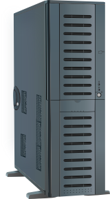

fsyscall
********

.. attention::
    fsyscall is under development. Some features described in this documentation
    have not been implemented yet.

.. contents:: Table of contents

Overview
========

fsyscall is a system to transfer system call requests from applications on
FreeBSD to another process through file descriptors. If you give a socket for
the file descriptors, fsyscall can request system calls to another machine
through network.

.. image:: overview.png

The follwing three figures show you one example of fsyscall's work.

1. When an application calls open(2), fsyscall sends it to another machine.
2. The requested machine does open(2) actually.
3. The machine sends a returned value of open(2) or errno. fsyscall gives it to
   the application.

.. image:: example1.png
.. image:: example2.png
.. image:: example3.png

fsyscall does not require any modifications on applications.

Expected merits of fsyscall are:

* using applications on FreeBSD from a non-FreeBSD machine such as Android.
* using a remote powerful machine as a local machine.
* maintaining remote machines with applications in a local machine.

There is a demerit:

* throughput of network I/O becomes that of file I/O.

.. attention:: fsyscall does not have any functions to connect a local machine
    to a remote machine. It is a role of other applications. nexec_ is one
    example. nexec connects a local slave machine to a remote master machine
    (the following section explains "master" and "slave").

.. _nexec: http://neko-daisuki.ddo.jp/~SumiTomohiko/nexec/index.html

Master and slave
================

In fsyscall, a machine requesting system calls is called as a "master". A
"slave" is defined as a machine accepting system calls.

.. image:: master_and_slave.png

You can use your machine as both of a master and a slave. It depends on an
application which you use.

A local machine as a master
---------------------------

If you use your machine as a master, you can control a slave with applications
in your machine.

.. image:: a_local_machine_as_a_master.png

A local machine as a slave
--------------------------

When your machine is a slave, you can use a master FreeBSD machine as a local
machine. You can use CPU/memory/applications in the master. These applications
can read/write files in your slave machine.

nexec_ is an application for this case. If you use nexec_, your machine becomes
a slave. The client of nexec_ connects to a server which works as a master.

.. image:: a_local_machine_as_a_slave.png

If your machine is Android and someone implements slave side of fsyscall
protocol for Android, you will be able to use your Android tablet like a FreeBSD
machine.

Structure
=========

This section explains modules of fsyscall and how they work.

Hub system
----------

One feature of Unix is fork(2). An application can do one or more fork(2) to use
helper applications. To support this feature, fsyscall use HUBs.

.. image:: structure.png

A master machine includes:

1. One or more master processes. These are applications itself. One of them is
   what a user started. Rest of them are forked processes from the first one or
   its children (All of them uses the kernel module fmaster.ko. It will be
   explained later).
2. One MASTER HUB whose name is fmhub (Fsyscall Master HUB). One of its roles is
   sending messages from master processes to the slave machine with appening
   pid. A master hub also receives messages from the slave machine. It
   distributes a message to a destination processe which is specified in the
   message.

A slave machine includes:

1. One or more slave processes. One slave process is for one master process. A
   slave process does system call for its master process in the slave machine.
   If its master process did fork(2), the slave process also does fork(2). The
   new slave process is for the new master process. Name of the executable for
   slave process is fslave (Fsyscall SLAVE).
2. One SLAVE HUB whose name is fshub (Fsyscall Slave HUB). Its job is the same
   as a master hub -- sending messages from slave processes to the master
   machine, and distributing messages from the master machine.

Master processes and slave processes do not know about hubs. They think that
they are directly connected.

.. attention:: fork(2) for fsyscall have not been implemented yet (2013-04-18).

Master process with fmaster.ko
------------------------------

Any ELF binaries are available for fsyscall without any modifications. All
mechanism is in fmaster.ko which is a kernel module.

fmaster.ko includes a system call entry table. Some entries are same as these of
original FreeBSD kernel. Rest of these are special entries for fsyscall. In such
special entries, a system call request is serialized and sent to a slave through
a master hub.

fmaster.ko does not send all requests. For example, an executable often needs
one or more libraries such as libc.so. These libraries must be opened in the
master machine because these will be mmap(2)'ed later, and because these must
have binary compatibility with the executable. So fmaster.ko opens such
libraries in the master machine. Since other files are opened in the slave
machine, fmaster.ko knows which file descriptor is on the slave, or on the
master. If an application requests to mmap(2) with a file descriptor, fmaster.ko
accepts the request only when the file descriptor is in the master machine (The
request is rejected when the file descriptor is in the slave).

.. image:: open_file.png

Master hub (fmhub)
------------------

Main role of fmhub is transfering messages from/to master processes.

Additionaly, fmhub has one more important role. That is sending signal to master
processes. If a user signals one of slave processes, fslave send signal
information to the master machine. When fmhub receives the message, it send the
same signal to the corresponding master process instead of the user.

.. image:: signal.png

.. attention:: Signal handling have not been implemented yet (2013-04-18).

Slave hub (fshub)
-----------------

All fshub does is transfering messages as described in the above section. fshub
is a simple application.

Slave process (fslave)
----------------------

A slave process works as ordered by a master process. It does system calls
actually with sending the results.

Restrictions
============

fsyscall cannot execute an application which needs mmap(2).
-----------------------------------------------------------

As described above, a master process opens libraries in the master machine. But
if the application does mmap(2) for a non-library file, it fails. Because there
are no ways to share memory with the slave machine (The file may be mmap(2)'ed
in the slave machine by another non-fsyscall process).

Thread
------

The current implementation does not handle threads. The author is guessing that
lock of connection between master process and master hub is needed.

Problems
========

fsyscall has over 1,000 problems.

1. Security. fslave must have access control mechanism.
#. Security. fslave must have access control mechanism.
#. Security. fslave must have access control mechanism.
#. Security. fslave must have access control mechanism.
#. Security. fslave must have access control mechanism.
#. Security. fslave must have access control mechanism.
#. Security. fslave must have access control mechanism.
#. Security. fslave must have access control mechanism.
#. Security. fslave must have access control mechanism.
#. Security. fslave must have access control mechanism.
#. Security. fslave must have access control mechanism.
#. Security. fslave must have access control mechanism.
#. Security. fslave must have access control mechanism.
#. Security. fslave must have access control mechanism.
#. Security. fslave must have access control mechanism.
#. Security. fslave must have access control mechanism.
#. Security. fslave must have access control mechanism.
#. Security. fslave must have access control mechanism.
#. Security. fslave must have access control mechanism.
#. Security. fslave must have access control mechanism.
#. Security. fslave must have access control mechanism.
#. Security. fslave must have access control mechanism.
#. Security. fslave must have access control mechanism.
#. Security. fslave must have access control mechanism.
#. Security. fslave must have access control mechanism.
#. Security. fslave must have access control mechanism.
#. Security. fslave must have access control mechanism.
#. Security. fslave must have access control mechanism.
#. Security. fslave must have access control mechanism.
#. Security. fslave must have access control mechanism.
#. Security. fslave must have access control mechanism.
#. Security. fslave must have access control mechanism.
#. Security. fslave must have access control mechanism.
#. Security. fslave must have access control mechanism.
#. Security. fslave must have access control mechanism.
#. Security. fslave must have access control mechanism.
#. Security. fslave must have access control mechanism.
#. Security. fslave must have access control mechanism.
#. Security. fslave must have access control mechanism.
#. Security. fslave must have access control mechanism.
#. Security. fslave must have access control mechanism.
#. Security. fslave must have access control mechanism.
#. Security. fslave must have access control mechanism.
#. Security. fslave must have access control mechanism.
#. Security. fslave must have access control mechanism.
#. Security. fslave must have access control mechanism.
#. Security. fslave must have access control mechanism.
#. Security. fslave must have access control mechanism.
#. Security. fslave must have access control mechanism.
#. Security. fslave must have access control mechanism.
#. Security. fslave must have access control mechanism.
#. Security. fslave must have access control mechanism.
#. Security. fslave must have access control mechanism.
#. Security. fslave must have access control mechanism.
#. Security. fslave must have access control mechanism.
#. Security. fslave must have access control mechanism.
#. Security. fslave must have access control mechanism.
#. Security. fslave must have access control mechanism.
#. Security. fslave must have access control mechanism.
#. Security. fslave must have access control mechanism.
#. Security. fslave must have access control mechanism.
#. Security. fslave must have access control mechanism.
#. Security. fslave must have access control mechanism.
#. Security. fslave must have access control mechanism.
#. Security. fslave must have access control mechanism.
#. Security. fslave must have access control mechanism.
#. Security. fslave must have access control mechanism.
#. Security. fslave must have access control mechanism.
#. Security. fslave must have access control mechanism.
#. Security. fslave must have access control mechanism.
#. Security. fslave must have access control mechanism.
#. Security. fslave must have access control mechanism.
#. Security. fslave must have access control mechanism.
#. Security. fslave must have access control mechanism.
#. Security. fslave must have access control mechanism.
#. Security. fslave must have access control mechanism.
#. Security. fslave must have access control mechanism.
#. Security. fslave must have access control mechanism.
#. Security. fslave must have access control mechanism.
#. Security. fslave must have access control mechanism.
#. Security. fslave must have access control mechanism.
#. Security. fslave must have access control mechanism.
#. Security. fslave must have access control mechanism.
#. Security. fslave must have access control mechanism.
#. Security. fslave must have access control mechanism.
#. Security. fslave must have access control mechanism.
#. Security. fslave must have access control mechanism.
#. Security. fslave must have access control mechanism.
#. Security. fslave must have access control mechanism.
#. Security. fslave must have access control mechanism.
#. Security. fslave must have access control mechanism.
#. Security. fslave must have access control mechanism.
#. Security. fslave must have access control mechanism.
#. Security. fslave must have access control mechanism.
#. Security. fslave must have access control mechanism.
#. Security. fslave must have access control mechanism.
#. Security. fslave must have access control mechanism.
#. Security. fslave must have access control mechanism.
#. Security. fslave must have access control mechanism.
#. Security. fslave must have access control mechanism.
#. Security. fslave must have access control mechanism.
#. Security. fslave must have access control mechanism.
#. Security. fslave must have access control mechanism.
#. Security. fslave must have access control mechanism.
#. Security. fslave must have access control mechanism.
#. Security. fslave must have access control mechanism.
#. Security. fslave must have access control mechanism.
#. Security. fslave must have access control mechanism.
#. Security. fslave must have access control mechanism.
#. Security. fslave must have access control mechanism.
#. Security. fslave must have access control mechanism.
#. Security. fslave must have access control mechanism.
#. Security. fslave must have access control mechanism.
#. Security. fslave must have access control mechanism.
#. Security. fslave must have access control mechanism.
#. Security. fslave must have access control mechanism.
#. Security. fslave must have access control mechanism.
#. Security. fslave must have access control mechanism.
#. Security. fslave must have access control mechanism.
#. Security. fslave must have access control mechanism.
#. Security. fslave must have access control mechanism.
#. Security. fslave must have access control mechanism.
#. Security. fslave must have access control mechanism.
#. Security. fslave must have access control mechanism.
#. Security. fslave must have access control mechanism.
#. Security. fslave must have access control mechanism.
#. Security. fslave must have access control mechanism.
#. Security. fslave must have access control mechanism.
#. Security. fslave must have access control mechanism.
#. Security. fslave must have access control mechanism.
#. Security. fslave must have access control mechanism.
#. Security. fslave must have access control mechanism.
#. Security. fslave must have access control mechanism.
#. Security. fslave must have access control mechanism.
#. Security. fslave must have access control mechanism.
#. Security. fslave must have access control mechanism.
#. Security. fslave must have access control mechanism.
#. Security. fslave must have access control mechanism.
#. Security. fslave must have access control mechanism.
#. Security. fslave must have access control mechanism.
#. Security. fslave must have access control mechanism.
#. Security. fslave must have access control mechanism.
#. Security. fslave must have access control mechanism.
#. Security. fslave must have access control mechanism.
#. Security. fslave must have access control mechanism.
#. Security. fslave must have access control mechanism.
#. Security. fslave must have access control mechanism.
#. Security. fslave must have access control mechanism.
#. Security. fslave must have access control mechanism.
#. Security. fslave must have access control mechanism.
#. Security. fslave must have access control mechanism.
#. Security. fslave must have access control mechanism.
#. Security. fslave must have access control mechanism.
#. Security. fslave must have access control mechanism.
#. Security. fslave must have access control mechanism.
#. Security. fslave must have access control mechanism.
#. Security. fslave must have access control mechanism.
#. Security. fslave must have access control mechanism.
#. Security. fslave must have access control mechanism.
#. Security. fslave must have access control mechanism.
#. Security. fslave must have access control mechanism.
#. Security. fslave must have access control mechanism.
#. Security. fslave must have access control mechanism.
#. Security. fslave must have access control mechanism.
#. Security. fslave must have access control mechanism.
#. Security. fslave must have access control mechanism.
#. Security. fslave must have access control mechanism.
#. Security. fslave must have access control mechanism.
#. Security. fslave must have access control mechanism.
#. Security. fslave must have access control mechanism.
#. Security. fslave must have access control mechanism.
#. Security. fslave must have access control mechanism.
#. Security. fslave must have access control mechanism.
#. Security. fslave must have access control mechanism.
#. Security. fslave must have access control mechanism.
#. Security. fslave must have access control mechanism.
#. Security. fslave must have access control mechanism.
#. Security. fslave must have access control mechanism.
#. Security. fslave must have access control mechanism.
#. Security. fslave must have access control mechanism.
#. Security. fslave must have access control mechanism.
#. Security. fslave must have access control mechanism.
#. Security. fslave must have access control mechanism.
#. Security. fslave must have access control mechanism.
#. Security. fslave must have access control mechanism.
#. Security. fslave must have access control mechanism.
#. Security. fslave must have access control mechanism.
#. Security. fslave must have access control mechanism.
#. Security. fslave must have access control mechanism.
#. Security. fslave must have access control mechanism.
#. Security. fslave must have access control mechanism.
#. Security. fslave must have access control mechanism.
#. Security. fslave must have access control mechanism.
#. Security. fslave must have access control mechanism.
#. Security. fslave must have access control mechanism.
#. Security. fslave must have access control mechanism.
#. Security. fslave must have access control mechanism.
#. Security. fslave must have access control mechanism.
#. Security. fslave must have access control mechanism.
#. Security. fslave must have access control mechanism.
#. Security. fslave must have access control mechanism.
#. Security. fslave must have access control mechanism.
#. Security. fslave must have access control mechanism.
#. Security. fslave must have access control mechanism.
#. Security. fslave must have access control mechanism.
#. Security. fslave must have access control mechanism.
#. Security. fslave must have access control mechanism.
#. Security. fslave must have access control mechanism.
#. Security. fslave must have access control mechanism.
#. Security. fslave must have access control mechanism.
#. Security. fslave must have access control mechanism.
#. Security. fslave must have access control mechanism.
#. Security. fslave must have access control mechanism.
#. Security. fslave must have access control mechanism.
#. Security. fslave must have access control mechanism.
#. Security. fslave must have access control mechanism.
#. Security. fslave must have access control mechanism.
#. Security. fslave must have access control mechanism.
#. Security. fslave must have access control mechanism.
#. Security. fslave must have access control mechanism.
#. Security. fslave must have access control mechanism.
#. Security. fslave must have access control mechanism.
#. Security. fslave must have access control mechanism.
#. Security. fslave must have access control mechanism.
#. Security. fslave must have access control mechanism.
#. Security. fslave must have access control mechanism.
#. Security. fslave must have access control mechanism.
#. Security. fslave must have access control mechanism.
#. Security. fslave must have access control mechanism.
#. Security. fslave must have access control mechanism.
#. Security. fslave must have access control mechanism.
#. Security. fslave must have access control mechanism.
#. Security. fslave must have access control mechanism.
#. Security. fslave must have access control mechanism.
#. Security. fslave must have access control mechanism.
#. Security. fslave must have access control mechanism.
#. Security. fslave must have access control mechanism.
#. Security. fslave must have access control mechanism.
#. Security. fslave must have access control mechanism.
#. Security. fslave must have access control mechanism.
#. Security. fslave must have access control mechanism.
#. Security. fslave must have access control mechanism.
#. Security. fslave must have access control mechanism.
#. Security. fslave must have access control mechanism.
#. Security. fslave must have access control mechanism.
#. Security. fslave must have access control mechanism.
#. Security. fslave must have access control mechanism.
#. Security. fslave must have access control mechanism.
#. Security. fslave must have access control mechanism.
#. Security. fslave must have access control mechanism.
#. Security. fslave must have access control mechanism.
#. Security. fslave must have access control mechanism.
#. Security. fslave must have access control mechanism.
#. Security. fslave must have access control mechanism.
#. Security. fslave must have access control mechanism.
#. Security. fslave must have access control mechanism.
#. Security. fslave must have access control mechanism.
#. Security. fslave must have access control mechanism.
#. Security. fslave must have access control mechanism.
#. Security. fslave must have access control mechanism.
#. Security. fslave must have access control mechanism.
#. Security. fslave must have access control mechanism.
#. Security. fslave must have access control mechanism.
#. Security. fslave must have access control mechanism.
#. Security. fslave must have access control mechanism.
#. Security. fslave must have access control mechanism.
#. Security. fslave must have access control mechanism.
#. Security. fslave must have access control mechanism.
#. Security. fslave must have access control mechanism.
#. Security. fslave must have access control mechanism.
#. Security. fslave must have access control mechanism.
#. Security. fslave must have access control mechanism.
#. Security. fslave must have access control mechanism.
#. Security. fslave must have access control mechanism.
#. Security. fslave must have access control mechanism.
#. Security. fslave must have access control mechanism.
#. Security. fslave must have access control mechanism.
#. Security. fslave must have access control mechanism.
#. Security. fslave must have access control mechanism.
#. Security. fslave must have access control mechanism.
#. Security. fslave must have access control mechanism.
#. Security. fslave must have access control mechanism.
#. Security. fslave must have access control mechanism.
#. Security. fslave must have access control mechanism.
#. Security. fslave must have access control mechanism.
#. Security. fslave must have access control mechanism.
#. Security. fslave must have access control mechanism.
#. Security. fslave must have access control mechanism.
#. Security. fslave must have access control mechanism.
#. Security. fslave must have access control mechanism.
#. Security. fslave must have access control mechanism.
#. Security. fslave must have access control mechanism.
#. Security. fslave must have access control mechanism.
#. Security. fslave must have access control mechanism.
#. Security. fslave must have access control mechanism.
#. Security. fslave must have access control mechanism.
#. Security. fslave must have access control mechanism.
#. Security. fslave must have access control mechanism.
#. Security. fslave must have access control mechanism.
#. Security. fslave must have access control mechanism.
#. Security. fslave must have access control mechanism.
#. Security. fslave must have access control mechanism.
#. Security. fslave must have access control mechanism.
#. Security. fslave must have access control mechanism.
#. Security. fslave must have access control mechanism.
#. Security. fslave must have access control mechanism.
#. Security. fslave must have access control mechanism.
#. Security. fslave must have access control mechanism.
#. Security. fslave must have access control mechanism.
#. Security. fslave must have access control mechanism.
#. Security. fslave must have access control mechanism.
#. Security. fslave must have access control mechanism.
#. Security. fslave must have access control mechanism.
#. Security. fslave must have access control mechanism.
#. Security. fslave must have access control mechanism.
#. Security. fslave must have access control mechanism.
#. Security. fslave must have access control mechanism.
#. Security. fslave must have access control mechanism.
#. Security. fslave must have access control mechanism.
#. Security. fslave must have access control mechanism.
#. Security. fslave must have access control mechanism.
#. Security. fslave must have access control mechanism.
#. Security. fslave must have access control mechanism.
#. Security. fslave must have access control mechanism.
#. Security. fslave must have access control mechanism.
#. Security. fslave must have access control mechanism.
#. Security. fslave must have access control mechanism.
#. Security. fslave must have access control mechanism.
#. Security. fslave must have access control mechanism.
#. Security. fslave must have access control mechanism.
#. Security. fslave must have access control mechanism.
#. Security. fslave must have access control mechanism.
#. Security. fslave must have access control mechanism.
#. Security. fslave must have access control mechanism.
#. Security. fslave must have access control mechanism.
#. Security. fslave must have access control mechanism.
#. Security. fslave must have access control mechanism.
#. Security. fslave must have access control mechanism.
#. Security. fslave must have access control mechanism.
#. Security. fslave must have access control mechanism.
#. Security. fslave must have access control mechanism.
#. Security. fslave must have access control mechanism.
#. Security. fslave must have access control mechanism.
#. Security. fslave must have access control mechanism.
#. Security. fslave must have access control mechanism.
#. Security. fslave must have access control mechanism.
#. Security. fslave must have access control mechanism.
#. Security. fslave must have access control mechanism.
#. Security. fslave must have access control mechanism.
#. Security. fslave must have access control mechanism.
#. Security. fslave must have access control mechanism.
#. Security. fslave must have access control mechanism.
#. Security. fslave must have access control mechanism.
#. Security. fslave must have access control mechanism.
#. Security. fslave must have access control mechanism.
#. Security. fslave must have access control mechanism.
#. Security. fslave must have access control mechanism.
#. Security. fslave must have access control mechanism.
#. Security. fslave must have access control mechanism.
#. Security. fslave must have access control mechanism.
#. Security. fslave must have access control mechanism.
#. Security. fslave must have access control mechanism.
#. Security. fslave must have access control mechanism.
#. Security. fslave must have access control mechanism.
#. Security. fslave must have access control mechanism.
#. Security. fslave must have access control mechanism.
#. Security. fslave must have access control mechanism.
#. Security. fslave must have access control mechanism.
#. Security. fslave must have access control mechanism.
#. Security. fslave must have access control mechanism.
#. Security. fslave must have access control mechanism.
#. Security. fslave must have access control mechanism.
#. Security. fslave must have access control mechanism.
#. Security. fslave must have access control mechanism.
#. Security. fslave must have access control mechanism.
#. Security. fslave must have access control mechanism.
#. Security. fslave must have access control mechanism.
#. Security. fslave must have access control mechanism.
#. Security. fslave must have access control mechanism.
#. Security. fslave must have access control mechanism.
#. Security. fslave must have access control mechanism.
#. Security. fslave must have access control mechanism.
#. Security. fslave must have access control mechanism.
#. Security. fslave must have access control mechanism.
#. Security. fslave must have access control mechanism.
#. Security. fslave must have access control mechanism.
#. Security. fslave must have access control mechanism.
#. Security. fslave must have access control mechanism.
#. Security. fslave must have access control mechanism.
#. Security. fslave must have access control mechanism.
#. Security. fslave must have access control mechanism.
#. Security. fslave must have access control mechanism.
#. Security. fslave must have access control mechanism.
#. Security. fslave must have access control mechanism.
#. Security. fslave must have access control mechanism.
#. Security. fslave must have access control mechanism.
#. Security. fslave must have access control mechanism.
#. Security. fslave must have access control mechanism.
#. Security. fslave must have access control mechanism.
#. Security. fslave must have access control mechanism.
#. Security. fslave must have access control mechanism.
#. Security. fslave must have access control mechanism.
#. Security. fslave must have access control mechanism.
#. Security. fslave must have access control mechanism.
#. Security. fslave must have access control mechanism.
#. Security. fslave must have access control mechanism.
#. Security. fslave must have access control mechanism.
#. Security. fslave must have access control mechanism.
#. Security. fslave must have access control mechanism.
#. Security. fslave must have access control mechanism.
#. Security. fslave must have access control mechanism.
#. Security. fslave must have access control mechanism.
#. Security. fslave must have access control mechanism.
#. Security. fslave must have access control mechanism.
#. Security. fslave must have access control mechanism.
#. Security. fslave must have access control mechanism.
#. Security. fslave must have access control mechanism.
#. Security. fslave must have access control mechanism.
#. Security. fslave must have access control mechanism.
#. Security. fslave must have access control mechanism.
#. Security. fslave must have access control mechanism.
#. Security. fslave must have access control mechanism.
#. Security. fslave must have access control mechanism.
#. Security. fslave must have access control mechanism.
#. Security. fslave must have access control mechanism.
#. Security. fslave must have access control mechanism.
#. Security. fslave must have access control mechanism.
#. Security. fslave must have access control mechanism.
#. Security. fslave must have access control mechanism.
#. Security. fslave must have access control mechanism.
#. Security. fslave must have access control mechanism.
#. Security. fslave must have access control mechanism.
#. Security. fslave must have access control mechanism.
#. Security. fslave must have access control mechanism.
#. Security. fslave must have access control mechanism.
#. Security. fslave must have access control mechanism.
#. Security. fslave must have access control mechanism.
#. Security. fslave must have access control mechanism.
#. Security. fslave must have access control mechanism.
#. Security. fslave must have access control mechanism.
#. Security. fslave must have access control mechanism.
#. Security. fslave must have access control mechanism.
#. Security. fslave must have access control mechanism.
#. Security. fslave must have access control mechanism.
#. Security. fslave must have access control mechanism.
#. Security. fslave must have access control mechanism.
#. Security. fslave must have access control mechanism.
#. Security. fslave must have access control mechanism.
#. Security. fslave must have access control mechanism.
#. Security. fslave must have access control mechanism.
#. Security. fslave must have access control mechanism.
#. Security. fslave must have access control mechanism.
#. Security. fslave must have access control mechanism.
#. Security. fslave must have access control mechanism.
#. Security. fslave must have access control mechanism.
#. Security. fslave must have access control mechanism.
#. Security. fslave must have access control mechanism.
#. Security. fslave must have access control mechanism.
#. Security. fslave must have access control mechanism.
#. Security. fslave must have access control mechanism.
#. Security. fslave must have access control mechanism.
#. Security. fslave must have access control mechanism.
#. Security. fslave must have access control mechanism.
#. Security. fslave must have access control mechanism.
#. Security. fslave must have access control mechanism.
#. Security. fslave must have access control mechanism.
#. Security. fslave must have access control mechanism.
#. Security. fslave must have access control mechanism.
#. Security. fslave must have access control mechanism.
#. Security. fslave must have access control mechanism.
#. Security. fslave must have access control mechanism.
#. Security. fslave must have access control mechanism.
#. Security. fslave must have access control mechanism.
#. Security. fslave must have access control mechanism.
#. Security. fslave must have access control mechanism.
#. Security. fslave must have access control mechanism.
#. Security. fslave must have access control mechanism.
#. Security. fslave must have access control mechanism.
#. Security. fslave must have access control mechanism.
#. Security. fslave must have access control mechanism.
#. Security. fslave must have access control mechanism.
#. Security. fslave must have access control mechanism.
#. Security. fslave must have access control mechanism.
#. Security. fslave must have access control mechanism.
#. Security. fslave must have access control mechanism.
#. Security. fslave must have access control mechanism.
#. Security. fslave must have access control mechanism.
#. Security. fslave must have access control mechanism.
#. Security. fslave must have access control mechanism.
#. Security. fslave must have access control mechanism.
#. Security. fslave must have access control mechanism.
#. Security. fslave must have access control mechanism.
#. Security. fslave must have access control mechanism.
#. Security. fslave must have access control mechanism.
#. Security. fslave must have access control mechanism.
#. Security. fslave must have access control mechanism.
#. Security. fslave must have access control mechanism.
#. Security. fslave must have access control mechanism.
#. Security. fslave must have access control mechanism.
#. Security. fslave must have access control mechanism.
#. Security. fslave must have access control mechanism.
#. Security. fslave must have access control mechanism.
#. Security. fslave must have access control mechanism.
#. Security. fslave must have access control mechanism.
#. Security. fslave must have access control mechanism.
#. Security. fslave must have access control mechanism.
#. Security. fslave must have access control mechanism.
#. Security. fslave must have access control mechanism.
#. Security. fslave must have access control mechanism.
#. Security. fslave must have access control mechanism.
#. Security. fslave must have access control mechanism.
#. Security. fslave must have access control mechanism.
#. Security. fslave must have access control mechanism.
#. Security. fslave must have access control mechanism.
#. Security. fslave must have access control mechanism.
#. Security. fslave must have access control mechanism.
#. Security. fslave must have access control mechanism.
#. Security. fslave must have access control mechanism.
#. Security. fslave must have access control mechanism.
#. Security. fslave must have access control mechanism.
#. Security. fslave must have access control mechanism.
#. Security. fslave must have access control mechanism.
#. Security. fslave must have access control mechanism.
#. Security. fslave must have access control mechanism.
#. Security. fslave must have access control mechanism.
#. Security. fslave must have access control mechanism.
#. Security. fslave must have access control mechanism.
#. Security. fslave must have access control mechanism.
#. Security. fslave must have access control mechanism.
#. Security. fslave must have access control mechanism.
#. Security. fslave must have access control mechanism.
#. Security. fslave must have access control mechanism.
#. Security. fslave must have access control mechanism.
#. Security. fslave must have access control mechanism.
#. Security. fslave must have access control mechanism.
#. Security. fslave must have access control mechanism.
#. Security. fslave must have access control mechanism.
#. Security. fslave must have access control mechanism.
#. Security. fslave must have access control mechanism.
#. Security. fslave must have access control mechanism.
#. Security. fslave must have access control mechanism.
#. Security. fslave must have access control mechanism.
#. Security. fslave must have access control mechanism.
#. Security. fslave must have access control mechanism.
#. Security. fslave must have access control mechanism.
#. Security. fslave must have access control mechanism.
#. Security. fslave must have access control mechanism.
#. Security. fslave must have access control mechanism.
#. Security. fslave must have access control mechanism.
#. Security. fslave must have access control mechanism.
#. Security. fslave must have access control mechanism.
#. Security. fslave must have access control mechanism.
#. Security. fslave must have access control mechanism.
#. Security. fslave must have access control mechanism.
#. Security. fslave must have access control mechanism.
#. Security. fslave must have access control mechanism.
#. Security. fslave must have access control mechanism.
#. Security. fslave must have access control mechanism.
#. Security. fslave must have access control mechanism.
#. Security. fslave must have access control mechanism.
#. Security. fslave must have access control mechanism.
#. Security. fslave must have access control mechanism.
#. Security. fslave must have access control mechanism.
#. Security. fslave must have access control mechanism.
#. Security. fslave must have access control mechanism.
#. Security. fslave must have access control mechanism.
#. Security. fslave must have access control mechanism.
#. Security. fslave must have access control mechanism.
#. Security. fslave must have access control mechanism.
#. Security. fslave must have access control mechanism.
#. Security. fslave must have access control mechanism.
#. Security. fslave must have access control mechanism.
#. Security. fslave must have access control mechanism.
#. Security. fslave must have access control mechanism.
#. Security. fslave must have access control mechanism.
#. Security. fslave must have access control mechanism.
#. Security. fslave must have access control mechanism.
#. Security. fslave must have access control mechanism.
#. Security. fslave must have access control mechanism.
#. Security. fslave must have access control mechanism.
#. Security. fslave must have access control mechanism.
#. Security. fslave must have access control mechanism.
#. Security. fslave must have access control mechanism.
#. Security. fslave must have access control mechanism.
#. Security. fslave must have access control mechanism.
#. Security. fslave must have access control mechanism.
#. Security. fslave must have access control mechanism.
#. Security. fslave must have access control mechanism.
#. Security. fslave must have access control mechanism.
#. Security. fslave must have access control mechanism.
#. Security. fslave must have access control mechanism.
#. Security. fslave must have access control mechanism.
#. Security. fslave must have access control mechanism.
#. Security. fslave must have access control mechanism.
#. Security. fslave must have access control mechanism.
#. Security. fslave must have access control mechanism.
#. Security. fslave must have access control mechanism.
#. Security. fslave must have access control mechanism.
#. Security. fslave must have access control mechanism.
#. Security. fslave must have access control mechanism.
#. Security. fslave must have access control mechanism.
#. Security. fslave must have access control mechanism.
#. Security. fslave must have access control mechanism.
#. Security. fslave must have access control mechanism.
#. Security. fslave must have access control mechanism.
#. Security. fslave must have access control mechanism.
#. Security. fslave must have access control mechanism.
#. Security. fslave must have access control mechanism.
#. Security. fslave must have access control mechanism.
#. Security. fslave must have access control mechanism.
#. Security. fslave must have access control mechanism.
#. Security. fslave must have access control mechanism.
#. Security. fslave must have access control mechanism.
#. Security. fslave must have access control mechanism.
#. Security. fslave must have access control mechanism.
#. Security. fslave must have access control mechanism.
#. Security. fslave must have access control mechanism.
#. Security. fslave must have access control mechanism.
#. Security. fslave must have access control mechanism.
#. Security. fslave must have access control mechanism.
#. Security. fslave must have access control mechanism.
#. Security. fslave must have access control mechanism.
#. Security. fslave must have access control mechanism.
#. Security. fslave must have access control mechanism.
#. Security. fslave must have access control mechanism.
#. Security. fslave must have access control mechanism.
#. Security. fslave must have access control mechanism.
#. Security. fslave must have access control mechanism.
#. Security. fslave must have access control mechanism.
#. Security. fslave must have access control mechanism.
#. Security. fslave must have access control mechanism.
#. Security. fslave must have access control mechanism.
#. Security. fslave must have access control mechanism.
#. Security. fslave must have access control mechanism.
#. Security. fslave must have access control mechanism.
#. Security. fslave must have access control mechanism.
#. Security. fslave must have access control mechanism.
#. Security. fslave must have access control mechanism.
#. Security. fslave must have access control mechanism.
#. Security. fslave must have access control mechanism.
#. Security. fslave must have access control mechanism.
#. Security. fslave must have access control mechanism.
#. Security. fslave must have access control mechanism.
#. Security. fslave must have access control mechanism.
#. Security. fslave must have access control mechanism.
#. Security. fslave must have access control mechanism.
#. Security. fslave must have access control mechanism.
#. Security. fslave must have access control mechanism.
#. Security. fslave must have access control mechanism.
#. Security. fslave must have access control mechanism.
#. Security. fslave must have access control mechanism.
#. Security. fslave must have access control mechanism.
#. Security. fslave must have access control mechanism.
#. Security. fslave must have access control mechanism.
#. Security. fslave must have access control mechanism.
#. Security. fslave must have access control mechanism.
#. Security. fslave must have access control mechanism.
#. Security. fslave must have access control mechanism.
#. Security. fslave must have access control mechanism.
#. Security. fslave must have access control mechanism.
#. Security. fslave must have access control mechanism.
#. Security. fslave must have access control mechanism.
#. Security. fslave must have access control mechanism.
#. Security. fslave must have access control mechanism.
#. Security. fslave must have access control mechanism.
#. Security. fslave must have access control mechanism.
#. Security. fslave must have access control mechanism.
#. Security. fslave must have access control mechanism.
#. Security. fslave must have access control mechanism.
#. Security. fslave must have access control mechanism.
#. Security. fslave must have access control mechanism.
#. Security. fslave must have access control mechanism.
#. Security. fslave must have access control mechanism.
#. Security. fslave must have access control mechanism.
#. Security. fslave must have access control mechanism.
#. Security. fslave must have access control mechanism.
#. Security. fslave must have access control mechanism.
#. Security. fslave must have access control mechanism.
#. Security. fslave must have access control mechanism.
#. Security. fslave must have access control mechanism.
#. Security. fslave must have access control mechanism.
#. Security. fslave must have access control mechanism.
#. Security. fslave must have access control mechanism.
#. Security. fslave must have access control mechanism.
#. Security. fslave must have access control mechanism.
#. Security. fslave must have access control mechanism.
#. Security. fslave must have access control mechanism.
#. Security. fslave must have access control mechanism.
#. Security. fslave must have access control mechanism.
#. Security. fslave must have access control mechanism.
#. Security. fslave must have access control mechanism.
#. Security. fslave must have access control mechanism.
#. Security. fslave must have access control mechanism.
#. Security. fslave must have access control mechanism.
#. Security. fslave must have access control mechanism.
#. Security. fslave must have access control mechanism.
#. Security. fslave must have access control mechanism.
#. Security. fslave must have access control mechanism.
#. Security. fslave must have access control mechanism.
#. Security. fslave must have access control mechanism.
#. Security. fslave must have access control mechanism.
#. Security. fslave must have access control mechanism.
#. Security. fslave must have access control mechanism.
#. Security. fslave must have access control mechanism.
#. Security. fslave must have access control mechanism.
#. Security. fslave must have access control mechanism.
#. Security. fslave must have access control mechanism.
#. Security. fslave must have access control mechanism.
#. Security. fslave must have access control mechanism.
#. Security. fslave must have access control mechanism.
#. Security. fslave must have access control mechanism.
#. Security. fslave must have access control mechanism.
#. Security. fslave must have access control mechanism.
#. Security. fslave must have access control mechanism.
#. Security. fslave must have access control mechanism.
#. Security. fslave must have access control mechanism.
#. Security. fslave must have access control mechanism.
#. Security. fslave must have access control mechanism.
#. Security. fslave must have access control mechanism.
#. Security. fslave must have access control mechanism.
#. Security. fslave must have access control mechanism.
#. Security. fslave must have access control mechanism.
#. Security. fslave must have access control mechanism.
#. Security. fslave must have access control mechanism.
#. Security. fslave must have access control mechanism.
#. Security. fslave must have access control mechanism.
#. Security. fslave must have access control mechanism.
#. Security. fslave must have access control mechanism.
#. Security. fslave must have access control mechanism.
#. Security. fslave must have access control mechanism.
#. Security. fslave must have access control mechanism.
#. Security. fslave must have access control mechanism.
#. Security. fslave must have access control mechanism.
#. Security. fslave must have access control mechanism.
#. Security. fslave must have access control mechanism.
#. Security. fslave must have access control mechanism.
#. Security. fslave must have access control mechanism.
#. Security. fslave must have access control mechanism.
#. Security. fslave must have access control mechanism.
#. Security. fslave must have access control mechanism.
#. Security. fslave must have access control mechanism.
#. Security. fslave must have access control mechanism.
#. Security. fslave must have access control mechanism.
#. Security. fslave must have access control mechanism.
#. Security. fslave must have access control mechanism.
#. Security. fslave must have access control mechanism.
#. Security. fslave must have access control mechanism.
#. Security. fslave must have access control mechanism.
#. Security. fslave must have access control mechanism.
#. Security. fslave must have access control mechanism.
#. Security. fslave must have access control mechanism.
#. Security. fslave must have access control mechanism.
#. Security. fslave must have access control mechanism.
#. Security. fslave must have access control mechanism.
#. Security. fslave must have access control mechanism.
#. Security. fslave must have access control mechanism.
#. Security. fslave must have access control mechanism.
#. Security. fslave must have access control mechanism.
#. Security. fslave must have access control mechanism.
#. Security. fslave must have access control mechanism.
#. Security. fslave must have access control mechanism.
#. Security. fslave must have access control mechanism.
#. Security. fslave must have access control mechanism.
#. Security. fslave must have access control mechanism.
#. Security. fslave must have access control mechanism.
#. Security. fslave must have access control mechanism.
#. Security. fslave must have access control mechanism.
#. Security. fslave must have access control mechanism.
#. Security. fslave must have access control mechanism.
#. Security. fslave must have access control mechanism.
#. Security. fslave must have access control mechanism.
#. Security. fslave must have access control mechanism.
#. Security. fslave must have access control mechanism.
#. Security. fslave must have access control mechanism.
#. Security. fslave must have access control mechanism.
#. Security. fslave must have access control mechanism.
#. Security. fslave must have access control mechanism.
#. Security. fslave must have access control mechanism.
#. Security. fslave must have access control mechanism.
#. Security. fslave must have access control mechanism.
#. Security. fslave must have access control mechanism.
#. Security. fslave must have access control mechanism.
#. Security. fslave must have access control mechanism.
#. Security. fslave must have access control mechanism.
#. Security. fslave must have access control mechanism.
#. Security. fslave must have access control mechanism.
#. Security. fslave must have access control mechanism.
#. Security. fslave must have access control mechanism.
#. Security. fslave must have access control mechanism.
#. Security. fslave must have access control mechanism.
#. Security. fslave must have access control mechanism.
#. Security. fslave must have access control mechanism.
#. Security. fslave must have access control mechanism.
#. Security. fslave must have access control mechanism.
#. Security. fslave must have access control mechanism.
#. Security. fslave must have access control mechanism.
#. Security. fslave must have access control mechanism.
#. Security. fslave must have access control mechanism.
#. Security. fslave must have access control mechanism.
#. Security. fslave must have access control mechanism.
#. Security. fslave must have access control mechanism.
#. Security. fslave must have access control mechanism.
#. Security. fslave must have access control mechanism.
#. Security. fslave must have access control mechanism.
#. Security. fslave must have access control mechanism.
#. Security. fslave must have access control mechanism.
#. Security. fslave must have access control mechanism.
#. Security. fslave must have access control mechanism.
#. Security. fslave must have access control mechanism.
#. Security. fslave must have access control mechanism.
#. Security. fslave must have access control mechanism.
#. Security. fslave must have access control mechanism.
#. Security. fslave must have access control mechanism.
#. Security. fslave must have access control mechanism.
#. Security. fslave must have access control mechanism.
#. Security. fslave must have access control mechanism.
#. Security. fslave must have access control mechanism.
#. Security. fslave must have access control mechanism.
#. Security. fslave must have access control mechanism.
#. Security. fslave must have access control mechanism.
#. Security. fslave must have access control mechanism.
#. Security. fslave must have access control mechanism.
#. Security. fslave must have access control mechanism.
#. Security. fslave must have access control mechanism.
#. Security. fslave must have access control mechanism.
#. Security. fslave must have access control mechanism.
#. Security. fslave must have access control mechanism.
#. Security. fslave must have access control mechanism.
#. Security. fslave must have access control mechanism.
#. Security. fslave must have access control mechanism.
#. Security. fslave must have access control mechanism.
#. Security. fslave must have access control mechanism.
#. Security. fslave must have access control mechanism.
#. Security. fslave must have access control mechanism.
#. Security. fslave must have access control mechanism.
#. Security. fslave must have access control mechanism.
#. Security. fslave must have access control mechanism.
#. Security. fslave must have access control mechanism.
#. Security. fslave must have access control mechanism.
#. Security. fslave must have access control mechanism.
#. Security. fslave must have access control mechanism.
#. Security. fslave must have access control mechanism.
#. Security. fslave must have access control mechanism.
#. Security. fslave must have access control mechanism.
#. Security. fslave must have access control mechanism.
#. Security. fslave must have access control mechanism.
#. Security. fslave must have access control mechanism.
#. Security. fslave must have access control mechanism.
#. Security. fslave must have access control mechanism.
#. Security. fslave must have access control mechanism.
#. Security. fslave must have access control mechanism.
#. Security. fslave must have access control mechanism.
#. Security. fslave must have access control mechanism.
#. Security. fslave must have access control mechanism.
#. Security. fslave must have access control mechanism.
#. Security. fslave must have access control mechanism.
#. Security. fslave must have access control mechanism.
#. Security. fslave must have access control mechanism.
#. Security. fslave must have access control mechanism.
#. Security. fslave must have access control mechanism.
#. Security. fslave must have access control mechanism.
#. Security. fslave must have access control mechanism.
#. Security. fslave must have access control mechanism.
#. Security. fslave must have access control mechanism.
#. Security. fslave must have access control mechanism.
#. Security. fslave must have access control mechanism.
#. Security. fslave must have access control mechanism.
#. Security. fslave must have access control mechanism.
#. Security. fslave must have access control mechanism.
#. Security. fslave must have access control mechanism.
#. Security. fslave must have access control mechanism.
#. Security. fslave must have access control mechanism.
#. Security. fslave must have access control mechanism.
#. Security. fslave must have access control mechanism.
#. Security. fslave must have access control mechanism.
#. Security. fslave must have access control mechanism.
#. Security. fslave must have access control mechanism.
#. Security. fslave must have access control mechanism.
#. Security. fslave must have access control mechanism.
#. Security. fslave must have access control mechanism.
#. Security. fslave must have access control mechanism.
#. Security. fslave must have access control mechanism.
#. Security. fslave must have access control mechanism.
#. Security. fslave must have access control mechanism.
#. Security. fslave must have access control mechanism.
#. Security. fslave must have access control mechanism.
#. Security. fslave must have access control mechanism.
#. Security. fslave must have access control mechanism.
#. Security. fslave must have access control mechanism.
#. Security. fslave must have access control mechanism.
#. Security. fslave must have access control mechanism.
#. Security. fslave must have access control mechanism.
#. Security. fslave must have access control mechanism.
#. Security. fslave must have access control mechanism.
#. Security. fslave must have access control mechanism.
#. Security. fslave must have access control mechanism.
#. Security. fslave must have access control mechanism.
#. Security. fslave must have access control mechanism.
#. Security. fslave must have access control mechanism.
#. Security. fslave must have access control mechanism.
#. Security. fslave must have access control mechanism.
#. Security. fslave must have access control mechanism.
#. Security. fslave must have access control mechanism.
#. Security. fslave must have access control mechanism.
#. Security. fslave must have access control mechanism.
#. Security. fslave must have access control mechanism.
#. Security. fslave must have access control mechanism.
#. Security. fslave must have access control mechanism.
#. Security. fslave must have access control mechanism.
#. Security. fslave must have access control mechanism.
#. Security. fslave must have access control mechanism.
#. Security. fslave must have access control mechanism.
#. Security. fslave must have access control mechanism.
#. Security. fslave must have access control mechanism.
#. Security. fslave must have access control mechanism.
#. Security. fslave must have access control mechanism.
#. Security. fslave must have access control mechanism.
#. Security. fslave must have access control mechanism.
#. Security. fslave must have access control mechanism.
#. Security. fslave must have access control mechanism.
#. Security. fslave must have access control mechanism.
#. Security. fslave must have access control mechanism.
#. Security. fslave must have access control mechanism.
#. Security. fslave must have access control mechanism.
#. Security. fslave must have access control mechanism.
#. Security. fslave must have access control mechanism.
#. Security. fslave must have access control mechanism.
#. Security. fslave must have access control mechanism.
#. Security. fslave must have access control mechanism.
#. Security. fslave must have access control mechanism.
#. Security. fslave must have access control mechanism.
#. Security. fslave must have access control mechanism.
#. Security. fslave must have access control mechanism.
#. Security. fslave must have access control mechanism.
#. Security. fslave must have access control mechanism.
#. Security. fslave must have access control mechanism.
#. Security. fslave must have access control mechanism.
#. Security. fslave must have access control mechanism.
#. Security. fslave must have access control mechanism.
#. Security. fslave must have access control mechanism.
#. Security. fslave must have access control mechanism.
#. Security. fslave must have access control mechanism.
#. Security. fslave must have access control mechanism.
#. Security. fslave must have access control mechanism.
#. Security. fslave must have access control mechanism.
#. Security. fslave must have access control mechanism.
#. Security. fslave must have access control mechanism.
#. Security. fslave must have access control mechanism.
#. Security. fslave must have access control mechanism.
#. Security. fslave must have access control mechanism.
#. Security. fslave must have access control mechanism.
#. Security. fslave must have access control mechanism.
#. Security. fslave must have access control mechanism.
#. Security. fslave must have access control mechanism.
#. Security. fslave must have access control mechanism.
#. Security. fslave must have access control mechanism.
#. Security. fslave must have access control mechanism.
#. Security. fslave must have access control mechanism.
#. Security. fslave must have access control mechanism.
#. Security. fslave must have access control mechanism.
#. Security. fslave must have access control mechanism.
#. Security. fslave must have access control mechanism.
#. Security. fslave must have access control mechanism.
#. Security. fslave must have access control mechanism.
#. Security. fslave must have access control mechanism.
#. Security. fslave must have access control mechanism.
#. Security. fslave must have access control mechanism.
#. Security. fslave must have access control mechanism.
#. Security. fslave must have access control mechanism.
#. Security. fslave must have access control mechanism.
#. Security. fslave must have access control mechanism.
#. Security. fslave must have access control mechanism.
#. Security. fslave must have access control mechanism.
#. Security. fslave must have access control mechanism.
#. Security. fslave must have access control mechanism.
#. Security. fslave must have access control mechanism.
#. Security. fslave must have access control mechanism.
#. Security. fslave must have access control mechanism.
#. Security. fslave must have access control mechanism.
#. Security. fslave must have access control mechanism.
#. Security. fslave must have access control mechanism.
#. Security. fslave must have access control mechanism.
#. Security. fslave must have access control mechanism.
#. Security. fslave must have access control mechanism.
#. Security. fslave must have access control mechanism.
#. Security. fslave must have access control mechanism.
#. Security. fslave must have access control mechanism.
#. Security. fslave must have access control mechanism.
#. Security. fslave must have access control mechanism.
#. Security. fslave must have access control mechanism.
#. Security. fslave must have access control mechanism.
#. Security. fslave must have access control mechanism.
#. Security. fslave must have access control mechanism.
#. Security. fslave must have access control mechanism.
#. Security. fslave must have access control mechanism.
#. Security. fslave must have access control mechanism.
#. Security. fslave must have access control mechanism.
#. Security. fslave must have access control mechanism.
#. Security. fslave must have access control mechanism.
#. Security. fslave must have access control mechanism.
#. Security. fslave must have access control mechanism.
#. Security. fslave must have access control mechanism.
#. Security. fslave must have access control mechanism.
#. Security. fslave must have access control mechanism.
#. Security. fslave must have access control mechanism.
#. Security. fslave must have access control mechanism.
#. Security. fslave must have access control mechanism.
#. Security. fslave must have access control mechanism.
#. Security. fslave must have access control mechanism.
#. Security. fslave must have access control mechanism.
#. Security. fslave must have access control mechanism.
#. Security. fslave must have access control mechanism.
#. Security. fslave must have access control mechanism.
#. Security. fslave must have access control mechanism.
#. Security. fslave must have access control mechanism.
#. Security. fslave must have access control mechanism.
#. Security. fslave must have access control mechanism.
#. Security. fslave must have access control mechanism.
#. Security. fslave must have access control mechanism.
#. Security. fslave must have access control mechanism.
#. Security. fslave must have access control mechanism.
#. Security. fslave must have access control mechanism.
#. Security. fslave must have access control mechanism.
#. Security. fslave must have access control mechanism.

Supported system calls
======================

+------------------------+---------------------+-------------------------------+
|System call             |Status               |Description                    |
+========================+=====================+===============================+
|nosys                   ||not_supported|      |                               |
+------------------------+---------------------+-------------------------------+
|exit                    ||fully_supported|    |                               |
+------------------------+---------------------+-------------------------------+
|fork                    ||not_supported|      |                               |
+------------------------+---------------------+-------------------------------+
|read                    ||fully_supported|    |                               |
+------------------------+---------------------+-------------------------------+
|write                   ||fully_supported|    |                               |
+------------------------+---------------------+-------------------------------+
|open                    ||fully_supported|    |                               |
+------------------------+---------------------+-------------------------------+
|close                   ||fully_supported|    |                               |
+------------------------+---------------------+-------------------------------+
|wait4                   ||not_supported|      |                               |
+------------------------+---------------------+-------------------------------+
|link                    ||fully_supported|    |                               |
+------------------------+---------------------+-------------------------------+
|unlink                  ||not_supported|      |                               |
+------------------------+---------------------+-------------------------------+
|chdir                   ||not_supported|      |                               |
+------------------------+---------------------+-------------------------------+
|fchdir                  ||not_supported|      |                               |
+------------------------+---------------------+-------------------------------+
|mknod                   ||not_supported|      |                               |
+------------------------+---------------------+-------------------------------+
|chmod                   ||not_supported|      |                               |
+------------------------+---------------------+-------------------------------+
|chown                   ||not_supported|      |                               |
+------------------------+---------------------+-------------------------------+
|obreak                  ||fully_supported|    |obreak runs only in a master.  |
+------------------------+---------------------+-------------------------------+
|getpid                  ||not_supported|      |                               |
+------------------------+---------------------+-------------------------------+
|mount                   ||out_of_support|     |                               |
+------------------------+---------------------+-------------------------------+
|umount                  ||out_of_support|     |                               |
+------------------------+---------------------+-------------------------------+
|setuid                  ||not_supported|      |                               |
+------------------------+---------------------+-------------------------------+
|getuid                  ||not_supported|      |                               |
+------------------------+---------------------+-------------------------------+
|geteuid                 ||not_supported|      |                               |
+------------------------+---------------------+-------------------------------+
|ptrace                  ||out_of_support|     |                               |
+------------------------+---------------------+-------------------------------+
|recvmsg                 ||not_supported|      |                               |
+------------------------+---------------------+-------------------------------+
|sendmsg                 ||not_supported|      |                               |
+------------------------+---------------------+-------------------------------+
|recvfrom                ||not_supported|      |                               |
+------------------------+---------------------+-------------------------------+
|accept                  ||not_supported|      |                               |
+------------------------+---------------------+-------------------------------+
|getpeername             ||not_supported|      |                               |
+------------------------+---------------------+-------------------------------+
|getsockname             ||not_supported|      |                               |
+------------------------+---------------------+-------------------------------+
|access                  ||fully_supported|    |                               |
+------------------------+---------------------+-------------------------------+
|chflags                 ||not_supported|      |                               |
+------------------------+---------------------+-------------------------------+
|fchflags                ||not_supported|      |                               |
+------------------------+---------------------+-------------------------------+
|sync                    ||out_of_support|     |                               |
+------------------------+---------------------+-------------------------------+
|kill                    ||not_supported|      |                               |
+------------------------+---------------------+-------------------------------+
|getppid                 ||not_supported|      |                               |
+------------------------+---------------------+-------------------------------+
|dup                     ||not_supported|      |                               |
+------------------------+---------------------+-------------------------------+
|pipe                    ||not_supported|      |                               |
+------------------------+---------------------+-------------------------------+
|getegid                 ||not_supported|      |                               |
+------------------------+---------------------+-------------------------------+
|profile                 ||out_of_support|     |                               |
+------------------------+---------------------+-------------------------------+
|ktrace                  ||out_of_support|     |                               |
+------------------------+---------------------+-------------------------------+
|getpid                  ||not_supported|      |                               |
+------------------------+---------------------+-------------------------------+
|getlogin                ||not_supported|      |                               |
+------------------------+---------------------+-------------------------------+
|setlogin                ||not_supported|      |                               |
+------------------------+---------------------+-------------------------------+
|acct                    ||not_supported|      |                               |
+------------------------+---------------------+-------------------------------+
|signalstack             ||not_supported|      |                               |
+------------------------+---------------------+-------------------------------+
|ioctl                   ||partially_supported||ioctl is available only for    |
|                        |                     |a master side file descriptor. |
+------------------------+---------------------+-------------------------------+
|reboot                  ||out_of_support|     |                               |
+------------------------+---------------------+-------------------------------+
|revoke                  ||out_of_support|     |                               |
+------------------------+---------------------+-------------------------------+
|symlink                 ||not_supported|      |                               |
+------------------------+---------------------+-------------------------------+
|readlink                ||fully_supported|    |                               |
+------------------------+---------------------+-------------------------------+
|execve                  ||not_supported|      |                               |
+------------------------+---------------------+-------------------------------+
|umask                   ||not_supported|      |                               |
+------------------------+---------------------+-------------------------------+
|chroot                  ||out_of_support|     |                               |
+------------------------+---------------------+-------------------------------+
|msync                   ||not_supported|      |                               |
+------------------------+---------------------+-------------------------------+
|vfork                   ||not_supported|      |                               |
+------------------------+---------------------+-------------------------------+
|sbrk                    ||not_supported|      |                               |
+------------------------+---------------------+-------------------------------+
|sstk                    ||not_supported|      |                               |
+------------------------+---------------------+-------------------------------+
|vadvise                 ||not_supported|      |                               |
+------------------------+---------------------+-------------------------------+
|munmap                  ||fully_supported|    |                               |
+------------------------+---------------------+-------------------------------+
|mprotect                ||fully_supported|    |                               |
+------------------------+---------------------+-------------------------------+
|madvise                 ||fully_supported|    |                               |
+------------------------+---------------------+-------------------------------+
|mincore                 ||fully_supported|    |                               |
+------------------------+---------------------+-------------------------------+
|getgroups               ||not_supported|      |                               |
+------------------------+---------------------+-------------------------------+
|setgroups               ||not_supported|      |                               |
+------------------------+---------------------+-------------------------------+
|getpgrp                 ||not_supported|      |                               |
+------------------------+---------------------+-------------------------------+
|setpgid                 ||not_supported|      |                               |
+------------------------+---------------------+-------------------------------+
|setitimer               ||not_supported|      |                               |
+------------------------+---------------------+-------------------------------+
|swapon                  ||out_of_support|     |                               |
+------------------------+---------------------+-------------------------------+
|getitimer               ||not_supported|      |                               |
+------------------------+---------------------+-------------------------------+
|getdtablesize           ||not_supported|      |                               |
+------------------------+---------------------+-------------------------------+
|dup2                    ||not_supported|      |                               |
+------------------------+---------------------+-------------------------------+
|fcntl                   ||not_supported|      |                               |
+------------------------+---------------------+-------------------------------+
|select                  ||partially_supported||                               |
+------------------------+---------------------+-------------------------------+
|fsync                   ||not_supported|      |                               |
+------------------------+---------------------+-------------------------------+
|setpriority             ||not_supported|      |                               |
+------------------------+---------------------+-------------------------------+
|socket                  ||not_supported|      |                               |
+------------------------+---------------------+-------------------------------+
|connect                 ||not_supported|      |                               |
+------------------------+---------------------+-------------------------------+
|getpriority             ||not_supported|      |                               |
+------------------------+---------------------+-------------------------------+
|bind                    ||not_supported|      |                               |
+------------------------+---------------------+-------------------------------+
|setsockopt              ||not_supported|      |                               |
+------------------------+---------------------+-------------------------------+
|listen                  ||not_supported|      |                               |
+------------------------+---------------------+-------------------------------+
|gettimeofday            ||not_supported|      |                               |
+------------------------+---------------------+-------------------------------+
|getrusage               ||not_supported|      |                               |
+------------------------+---------------------+-------------------------------+
|getsockopt              ||not_supported|      |                               |
+------------------------+---------------------+-------------------------------+
|readv                   ||not_supported|      |                               |
+------------------------+---------------------+-------------------------------+
|writev                  ||fully_supported|    |                               |
+------------------------+---------------------+-------------------------------+
|settimeofday            ||not_supported|      |                               |
+------------------------+---------------------+-------------------------------+
|fchown                  ||not_supported|      |                               |
+------------------------+---------------------+-------------------------------+
|fchmod                  ||not_supported|      |                               |
+------------------------+---------------------+-------------------------------+
|setreuid                ||not_supported|      |                               |
+------------------------+---------------------+-------------------------------+
|setregid                ||not_supported|      |                               |
+------------------------+---------------------+-------------------------------+
|rename                  ||not_supported|      |                               |
+------------------------+---------------------+-------------------------------+
|flock                   ||not_supported|      |                               |
+------------------------+---------------------+-------------------------------+
|mkfifo                  ||not_supported|      |                               |
+------------------------+---------------------+-------------------------------+
|sendto                  ||not_supported|      |                               |
+------------------------+---------------------+-------------------------------+
|shutdown                ||not_supported|      |                               |
+------------------------+---------------------+-------------------------------+
|socketpair              ||not_supported|      |                               |
+------------------------+---------------------+-------------------------------+
|mkdir                   ||not_supported|      |                               |
+------------------------+---------------------+-------------------------------+
|rmdir                   ||not_supported|      |                               |
+------------------------+---------------------+-------------------------------+
|utimes                  ||not_supported|      |                               |
+------------------------+---------------------+-------------------------------+
|adjtime                 ||not_supported|      |                               |
+------------------------+---------------------+-------------------------------+
|setsid                  ||not_supported|      |                               |
+------------------------+---------------------+-------------------------------+
|quotactl                ||not_supported|      |                               |
+------------------------+---------------------+-------------------------------+
|nlm_syscall             ||not_supported|      |                               |
+------------------------+---------------------+-------------------------------+
|nfssvc                  ||not_supported|      |                               |
+------------------------+---------------------+-------------------------------+
|lgetfh                  ||not_supported|      |                               |
+------------------------+---------------------+-------------------------------+
|getfh                   ||not_supported|      |                               |
+------------------------+---------------------+-------------------------------+
|sysarch                 ||fully_supported|    |                               |
+------------------------+---------------------+-------------------------------+
|rtprio                  ||not_supported|      |                               |
+------------------------+---------------------+-------------------------------+
|semsys                  ||not_supported|      |                               |
+------------------------+---------------------+-------------------------------+
|msgsys                  ||not_supported|      |                               |
+------------------------+---------------------+-------------------------------+
|shmsys                  ||not_supported|      |                               |
+------------------------+---------------------+-------------------------------+
|setfib                  ||not_supported|      |                               |
+------------------------+---------------------+-------------------------------+
|ntp_adjtime             ||not_supported|      |                               |
+------------------------+---------------------+-------------------------------+
|getgid                  ||not_supported|      |                               |
+------------------------+---------------------+-------------------------------+
|getegid                 ||not_supported|      |                               |
+------------------------+---------------------+-------------------------------+
|geteuid                 ||not_supported|      |                               |
+------------------------+---------------------+-------------------------------+
|stat                    ||fully_supported|    |                               |
+------------------------+---------------------+-------------------------------+
|fstat                   ||fully_supported|    |                               |
+------------------------+---------------------+-------------------------------+
|lstat                   ||fully_supported|    |                               |
+------------------------+---------------------+-------------------------------+
|pathconf                ||not_supported|      |                               |
+------------------------+---------------------+-------------------------------+
|fpathconf               ||not_supported|      |                               |
+------------------------+---------------------+-------------------------------+
|getrlimit               ||not_supported|      |                               |
+------------------------+---------------------+-------------------------------+
|setrlimit               ||not_supported|      |                               |
+------------------------+---------------------+-------------------------------+
|getdirentries           ||not_supported|      |                               |
+------------------------+---------------------+-------------------------------+
|nosys                   ||fully_supported|    |                               |
+------------------------+---------------------+-------------------------------+
|__sysctl                ||not_supported|      |                               |
+------------------------+---------------------+-------------------------------+
|mlock                   ||not_supported|      |                               |
+------------------------+---------------------+-------------------------------+
|munlock                 ||not_supported|      |                               |
+------------------------+---------------------+-------------------------------+
|undelete                ||not_supported|      |                               |
+------------------------+---------------------+-------------------------------+
|futimes                 ||not_supported|      |                               |
+------------------------+---------------------+-------------------------------+
|getpgid                 ||not_supported|      |                               |
+------------------------+---------------------+-------------------------------+
|poll                    ||not_supported|      |                               |
+------------------------+---------------------+-------------------------------+
|__semctl                ||fully_supported|    |                               |
+------------------------+---------------------+-------------------------------+
|__semget                ||fully_supported|    |                               |
+------------------------+---------------------+-------------------------------+
|__semop                 ||fully_supported|    |                               |
+------------------------+---------------------+-------------------------------+
|msgctl                  ||fully_supported|    |                               |
+------------------------+---------------------+-------------------------------+
|msgget                  ||fully_supported|    |                               |
+------------------------+---------------------+-------------------------------+
|msgsnd                  ||fully_supported|    |                               |
+------------------------+---------------------+-------------------------------+
|msgrcv                  ||fully_supported|    |                               |
+------------------------+---------------------+-------------------------------+
|shmat                   ||fully_supported|    |                               |
+------------------------+---------------------+-------------------------------+
|shmctl                  ||fully_supported|    |                               |
+------------------------+---------------------+-------------------------------+
|shmdt                   ||fully_supported|    |                               |
+------------------------+---------------------+-------------------------------+
|shmget                  ||fully_supported|    |                               |
+------------------------+---------------------+-------------------------------+
|clock_gettime           ||not_supported|      |                               |
+------------------------+---------------------+-------------------------------+
|clock_settime           ||not_supported|      |                               |
+------------------------+---------------------+-------------------------------+
|clock_getres            ||not_supported|      |                               |
+------------------------+---------------------+-------------------------------+
|ktimer_create           ||not_supported|      |                               |
+------------------------+---------------------+-------------------------------+
|ktimer_delete           ||not_supported|      |                               |
+------------------------+---------------------+-------------------------------+
|ktimer_settime          ||not_supported|      |                               |
+------------------------+---------------------+-------------------------------+
|ktimer_gettime          ||not_supported|      |                               |
+------------------------+---------------------+-------------------------------+
|ktimer_getoverrun       ||not_supported|      |                               |
+------------------------+---------------------+-------------------------------+
|nanosleep               ||fully_supported|    |                               |
+------------------------+---------------------+-------------------------------+
|ntp_gettime             ||not_supported|      |                               |
+------------------------+---------------------+-------------------------------+
|minherit                ||fully_supported|    |                               |
+------------------------+---------------------+-------------------------------+
|rfork                   ||not_supported|      |                               |
+------------------------+---------------------+-------------------------------+
|issetugid               ||fully_supported|    |                               |
+------------------------+---------------------+-------------------------------+
|lchown                  ||not_supported|      |                               |
+------------------------+---------------------+-------------------------------+
|aio_read                ||not_supported|      |                               |
+------------------------+---------------------+-------------------------------+
|aio_write               ||not_supported|      |                               |
+------------------------+---------------------+-------------------------------+
|lio_listio              ||not_supported|      |                               |
+------------------------+---------------------+-------------------------------+
|getdents                ||not_supported|      |                               |
+------------------------+---------------------+-------------------------------+
|lchmod                  ||not_supported|      |                               |
+------------------------+---------------------+-------------------------------+
|lutimes                 ||not_supported|      |                               |
+------------------------+---------------------+-------------------------------+
|nstat                   ||not_supported|      |                               |
+------------------------+---------------------+-------------------------------+
|nfstat                  ||not_supported|      |                               |
+------------------------+---------------------+-------------------------------+
|nlstat                  ||not_supported|      |                               |
+------------------------+---------------------+-------------------------------+
|preadv                  ||not_supported|      |                               |
+------------------------+---------------------+-------------------------------+
|pwritev                 ||not_supported|      |                               |
+------------------------+---------------------+-------------------------------+
|fhopen                  ||not_supported|      |                               |
+------------------------+---------------------+-------------------------------+
|fhstat                  ||not_supported|      |                               |
+------------------------+---------------------+-------------------------------+
|modnext                 ||not_supported|      |                               |
+------------------------+---------------------+-------------------------------+
|modstat                 ||not_supported|      |                               |
+------------------------+---------------------+-------------------------------+
|modfnext                ||not_supported|      |                               |
+------------------------+---------------------+-------------------------------+
|modfind                 ||not_supported|      |                               |
+------------------------+---------------------+-------------------------------+
|kldload                 ||not_supported|      |                               |
+------------------------+---------------------+-------------------------------+
|kldunload               ||not_supported|      |                               |
+------------------------+---------------------+-------------------------------+
|kldfind                 ||not_supported|      |                               |
+------------------------+---------------------+-------------------------------+
|kldnext                 ||not_supported|      |                               |
+------------------------+---------------------+-------------------------------+
|kldstat                 ||not_supported|      |                               |
+------------------------+---------------------+-------------------------------+
|kldfirstmod             ||not_supported|      |                               |
+------------------------+---------------------+-------------------------------+
|getsid                  ||not_supported|      |                               |
+------------------------+---------------------+-------------------------------+
|setresuid               ||not_supported|      |                               |
+------------------------+---------------------+-------------------------------+
|setresgid               ||not_supported|      |                               |
+------------------------+---------------------+-------------------------------+
|aio_return              ||not_supported|      |                               |
+------------------------+---------------------+-------------------------------+
|aio_suspend             ||not_supported|      |                               |
+------------------------+---------------------+-------------------------------+
|aio_cancel              ||not_supported|      |                               |
+------------------------+---------------------+-------------------------------+
|aio_error               ||not_supported|      |                               |
+------------------------+---------------------+-------------------------------+
|oaio_read               ||not_supported|      |                               |
+------------------------+---------------------+-------------------------------+
|oaio_write              ||not_supported|      |                               |
+------------------------+---------------------+-------------------------------+
|olio_listio             ||not_supported|      |                               |
+------------------------+---------------------+-------------------------------+
|yield                   ||not_supported|      |                               |
+------------------------+---------------------+-------------------------------+
|mlockall                ||fully_supported|    |                               |
+------------------------+---------------------+-------------------------------+
|munlockall              ||fully_supported|    |                               |
+------------------------+---------------------+-------------------------------+
|__getcwd                ||not_supported|      |                               |
+------------------------+---------------------+-------------------------------+
|sched_setparam          ||not_supported|      |                               |
+------------------------+---------------------+-------------------------------+
|sched_getparam          ||not_supported|      |                               |
+------------------------+---------------------+-------------------------------+
|sched_setscheduler      ||not_supported|      |                               |
+------------------------+---------------------+-------------------------------+
|sched_getscheduler      ||not_supported|      |                               |
+------------------------+---------------------+-------------------------------+
|sched_yield             ||not_supported|      |                               |
+------------------------+---------------------+-------------------------------+
|sched_get_priority_max  ||not_supported|      |                               |
+------------------------+---------------------+-------------------------------+
|sched_get_priority_min  ||not_supported|      |                               |
+------------------------+---------------------+-------------------------------+
|sched_rr_get_interval   ||not_supported|      |                               |
+------------------------+---------------------+-------------------------------+
|utrace                  ||not_supported|      |                               |
+------------------------+---------------------+-------------------------------+
|kldsym                  ||not_supported|      |                               |
+------------------------+---------------------+-------------------------------+
|jail                    ||not_supported|      |                               |
+------------------------+---------------------+-------------------------------+
|nnpfs_syscall           ||not_supported|      |                               |
+------------------------+---------------------+-------------------------------+
|sigprocmask             ||fully_supported|    |                               |
+------------------------+---------------------+-------------------------------+
|sigsuspend              ||fully_supported|    |                               |
+------------------------+---------------------+-------------------------------+
|sigpending              ||fully_supported|    |                               |
+------------------------+---------------------+-------------------------------+
|sigtimedwait            ||fully_supported|    |                               |
+------------------------+---------------------+-------------------------------+
|sigwaitinfo             ||fully_supported|    |                               |
+------------------------+---------------------+-------------------------------+
|__acl_get_file          ||not_supported|      |                               |
+------------------------+---------------------+-------------------------------+
|__acl_set_file          ||not_supported|      |                               |
+------------------------+---------------------+-------------------------------+
|__acl_get_fd            ||not_supported|      |                               |
+------------------------+---------------------+-------------------------------+
|__acl_set_fd            ||not_supported|      |                               |
+------------------------+---------------------+-------------------------------+
|__acl_delete_file       ||not_supported|      |                               |
+------------------------+---------------------+-------------------------------+
|__acl_delete_fd         ||not_supported|      |                               |
+------------------------+---------------------+-------------------------------+
|__acl_aclcheck_file     ||not_supported|      |                               |
+------------------------+---------------------+-------------------------------+
|__acl_aclcheck_fd       ||not_supported|      |                               |
+------------------------+---------------------+-------------------------------+
|extattrctl              ||not_supported|      |                               |
+------------------------+---------------------+-------------------------------+
|extattr_set_file        ||not_supported|      |                               |
+------------------------+---------------------+-------------------------------+
|extattr_get_file        ||not_supported|      |                               |
+------------------------+---------------------+-------------------------------+
|extattr_delete_file     ||not_supported|      |                               |
+------------------------+---------------------+-------------------------------+
|aio_waitcomplete        ||not_supported|      |                               |
+------------------------+---------------------+-------------------------------+
|getresuid               ||not_supported|      |                               |
+------------------------+---------------------+-------------------------------+
|getresgid               ||not_supported|      |                               |
+------------------------+---------------------+-------------------------------+
|kqueue                  ||not_supported|      |                               |
+------------------------+---------------------+-------------------------------+
|kevent                  ||not_supported|      |                               |
+------------------------+---------------------+-------------------------------+
|extattr_set_fd          ||not_supported|      |                               |
+------------------------+---------------------+-------------------------------+
|extattr_get_fd          ||not_supported|      |                               |
+------------------------+---------------------+-------------------------------+
|extattr_delete_fd       ||not_supported|      |                               |
+------------------------+---------------------+-------------------------------+
|__setugid               ||not_supported|      |                               |
+------------------------+---------------------+-------------------------------+
|eaccess                 ||not_supported|      |                               |
+------------------------+---------------------+-------------------------------+
|afs3_syscall            ||not_supported|      |                               |
+------------------------+---------------------+-------------------------------+
|nmount                  ||not_supported|      |                               |
+------------------------+---------------------+-------------------------------+
|__mac_get_proc          ||not_supported|      |                               |
+------------------------+---------------------+-------------------------------+
|__mac_set_proc          ||not_supported|      |                               |
+------------------------+---------------------+-------------------------------+
|__mac_get_fd            ||not_supported|      |                               |
+------------------------+---------------------+-------------------------------+
|__mac_get_file          ||not_supported|      |                               |
+------------------------+---------------------+-------------------------------+
|__mac_set_fd            ||not_supported|      |                               |
+------------------------+---------------------+-------------------------------+
|__mac_set_file          ||not_supported|      |                               |
+------------------------+---------------------+-------------------------------+
|kenv                    ||not_supported|      |                               |
+------------------------+---------------------+-------------------------------+
|lchflags                ||not_supported|      |                               |
+------------------------+---------------------+-------------------------------+
|uuidgen                 ||fully_supported|    |                               |
+------------------------+---------------------+-------------------------------+
|sendfile                ||not_supported|      |                               |
+------------------------+---------------------+-------------------------------+
|mac_syscall             ||not_supported|      |                               |
+------------------------+---------------------+-------------------------------+
|getfsstat               ||not_supported|      |                               |
+------------------------+---------------------+-------------------------------+
|statfs                  ||not_supported|      |                               |
+------------------------+---------------------+-------------------------------+
|fstatfs                 ||not_supported|      |                               |
+------------------------+---------------------+-------------------------------+
|fhstatfs                ||not_supported|      |                               |
+------------------------+---------------------+-------------------------------+
|ksem_close              ||not_supported|      |                               |
+------------------------+---------------------+-------------------------------+
|ksem_post               ||not_supported|      |                               |
+------------------------+---------------------+-------------------------------+
|ksem_wait               ||not_supported|      |                               |
+------------------------+---------------------+-------------------------------+
|ksem_trywait            ||not_supported|      |                               |
+------------------------+---------------------+-------------------------------+
|ksem_init               ||not_supported|      |                               |
+------------------------+---------------------+-------------------------------+
|ksem_open               ||not_supported|      |                               |
+------------------------+---------------------+-------------------------------+
|ksem_unlink             ||not_supported|      |                               |
+------------------------+---------------------+-------------------------------+
|ksem_getvalue           ||not_supported|      |                               |
+------------------------+---------------------+-------------------------------+
|ksem_destroy            ||not_supported|      |                               |
+------------------------+---------------------+-------------------------------+
|__mac_get_pid           ||not_supported|      |                               |
+------------------------+---------------------+-------------------------------+
|__mac_get_link          ||not_supported|      |                               |
+------------------------+---------------------+-------------------------------+
|__mac_set_link          ||not_supported|      |                               |
+------------------------+---------------------+-------------------------------+
|extattr_set_link        ||not_supported|      |                               |
+------------------------+---------------------+-------------------------------+
|extattr_get_link        ||not_supported|      |                               |
+------------------------+---------------------+-------------------------------+
|extattr_delete_link     ||not_supported|      |                               |
+------------------------+---------------------+-------------------------------+
|__mac_execve            ||not_supported|      |                               |
+------------------------+---------------------+-------------------------------+
|sigaction               ||fully_supported|    |                               |
+------------------------+---------------------+-------------------------------+
|sigreturn               ||fully_supported|    |                               |
+------------------------+---------------------+-------------------------------+
|getcontext              ||not_supported|      |                               |
+------------------------+---------------------+-------------------------------+
|setcontext              ||not_supported|      |                               |
+------------------------+---------------------+-------------------------------+
|swapcontext             ||not_supported|      |                               |
+------------------------+---------------------+-------------------------------+
|swapoff                 ||fully_supported|    |                               |
+------------------------+---------------------+-------------------------------+
|__acl_get_link          ||not_supported|      |                               |
+------------------------+---------------------+-------------------------------+
|__acl_set_link          ||not_supported|      |                               |
+------------------------+---------------------+-------------------------------+
|__acl_delete_link       ||not_supported|      |                               |
+------------------------+---------------------+-------------------------------+
|__acl_aclcheck_link     ||not_supported|      |                               |
+------------------------+---------------------+-------------------------------+
|sigwait                 ||fully_supported|    |                               |
+------------------------+---------------------+-------------------------------+
|thr_create              ||not_supported|      |                               |
+------------------------+---------------------+-------------------------------+
|thr_exit                ||not_supported|      |                               |
+------------------------+---------------------+-------------------------------+
|thr_self                ||not_supported|      |                               |
+------------------------+---------------------+-------------------------------+
|thr_kill                ||not_supported|      |                               |
+------------------------+---------------------+-------------------------------+
|_umtx_lock              ||not_supported|      |                               |
+------------------------+---------------------+-------------------------------+
|_umtx_unlock            ||not_supported|      |                               |
+------------------------+---------------------+-------------------------------+
|jail_attach             ||not_supported|      |                               |
+------------------------+---------------------+-------------------------------+
|extattr_list_fd         ||not_supported|      |                               |
+------------------------+---------------------+-------------------------------+
|extattr_list_file       ||not_supported|      |                               |
+------------------------+---------------------+-------------------------------+
|extattr_list_link       ||not_supported|      |                               |
+------------------------+---------------------+-------------------------------+
|ksem_timedwait          ||not_supported|      |                               |
+------------------------+---------------------+-------------------------------+
|thr_suspend             ||not_supported|      |                               |
+------------------------+---------------------+-------------------------------+
|thr_wait                ||not_supported|      |                               |
+------------------------+---------------------+-------------------------------+
|kldunloadf              ||not_supported|      |                               |
+------------------------+---------------------+-------------------------------+
|audit                   ||not_supported|      |                               |
+------------------------+---------------------+-------------------------------+
|auditon                 ||not_supported|      |                               |
+------------------------+---------------------+-------------------------------+
|getauid                 ||not_supported|      |                               |
+------------------------+---------------------+-------------------------------+
|setauid                 ||not_supported|      |                               |
+------------------------+---------------------+-------------------------------+
|getaudit                ||not_supported|      |                               |
+------------------------+---------------------+-------------------------------+
|setaudit                ||not_supported|      |                               |
+------------------------+---------------------+-------------------------------+
|getaudit_addr           ||not_supported|      |                               |
+------------------------+---------------------+-------------------------------+
|setaudit_addr           ||not_supported|      |                               |
+------------------------+---------------------+-------------------------------+
|auditctl                ||not_supported|      |                               |
+------------------------+---------------------+-------------------------------+
|_umtx_op                ||not_supported|      |                               |
+------------------------+---------------------+-------------------------------+
|thr_new                 ||not_supported|      |                               |
+------------------------+---------------------+-------------------------------+
|sigqueue                ||fully_supported|    |                               |
+------------------------+---------------------+-------------------------------+
|kmq_open                ||not_supported|      |                               |
+------------------------+---------------------+-------------------------------+
|kmq_setattr             ||not_supported|      |                               |
+------------------------+---------------------+-------------------------------+
|kmq_timedreceive        ||not_supported|      |                               |
+------------------------+---------------------+-------------------------------+
|kmq_timedsend           ||not_supported|      |                               |
+------------------------+---------------------+-------------------------------+
|kmq_notify              ||not_supported|      |                               |
+------------------------+---------------------+-------------------------------+
|kmq_unlink              ||not_supported|      |                               |
+------------------------+---------------------+-------------------------------+
|abort2                  ||not_supported|      |                               |
+------------------------+---------------------+-------------------------------+
|thr_set_name            ||not_supported|      |                               |
+------------------------+---------------------+-------------------------------+
|aio_fsync               ||not_supported|      |                               |
+------------------------+---------------------+-------------------------------+
|rtprio_thread           ||not_supported|      |                               |
+------------------------+---------------------+-------------------------------+
|sctp_peeloff            ||not_supported|      |                               |
+------------------------+---------------------+-------------------------------+
|sctp_generic_sendmsg    ||not_supported|      |                               |
+------------------------+---------------------+-------------------------------+
|sctp_generic_sendmsg_iov||not_supported|      |                               |
+------------------------+---------------------+-------------------------------+
|sctp_generic_recvmsg    ||not_supported|      |                               |
+------------------------+---------------------+-------------------------------+
|sctp_pread              ||fully_supported|    |                               |
+------------------------+---------------------+-------------------------------+
|sctp_pwrite             ||not_supported|      |                               |
+------------------------+---------------------+-------------------------------+
|mmap                    ||fully_supported|    |                               |
+------------------------+---------------------+-------------------------------+
|lseek                   ||fully_supported|    |                               |
+------------------------+---------------------+-------------------------------+
|truncate                ||not_supported|      |                               |
+------------------------+---------------------+-------------------------------+
|ftruncate               ||not_supported|      |                               |
+------------------------+---------------------+-------------------------------+
|thr_kill2               ||not_supported|      |                               |
+------------------------+---------------------+-------------------------------+
|shm_open                ||fully_supported|    |                               |
+------------------------+---------------------+-------------------------------+
|shm_unlink              ||fully_supported|    |                               |
+------------------------+---------------------+-------------------------------+
|cpuset                  ||fully_supported|    |                               |
+------------------------+---------------------+-------------------------------+
|cpuset_setid            ||fully_supported|    |                               |
+------------------------+---------------------+-------------------------------+
|cpuset_getid            ||fully_supported|    |                               |
+------------------------+---------------------+-------------------------------+
|cpuset_getaffinity      ||fully_supported|    |                               |
+------------------------+---------------------+-------------------------------+
|cpuset_setaffinity      ||fully_supported|    |                               |
+------------------------+---------------------+-------------------------------+
|faccessat               ||not_supported|      |                               |
+------------------------+---------------------+-------------------------------+
|fchmodat                ||not_supported|      |                               |
+------------------------+---------------------+-------------------------------+
|fchownat                ||not_supported|      |                               |
+------------------------+---------------------+-------------------------------+
|fexecve                 ||not_supported|      |                               |
+------------------------+---------------------+-------------------------------+
|fstatat                 ||not_supported|      |                               |
+------------------------+---------------------+-------------------------------+
|futimesat               ||not_supported|      |                               |
+------------------------+---------------------+-------------------------------+
|linkat                  ||not_supported|      |                               |
+------------------------+---------------------+-------------------------------+
|mkdirat                 ||not_supported|      |                               |
+------------------------+---------------------+-------------------------------+
|mkfifoat                ||not_supported|      |                               |
+------------------------+---------------------+-------------------------------+
|mknodat                 ||not_supported|      |                               |
+------------------------+---------------------+-------------------------------+
|openat                  ||not_supported|      |                               |
+------------------------+---------------------+-------------------------------+
|readlinkat              ||not_supported|      |                               |
+------------------------+---------------------+-------------------------------+
|renameat                ||not_supported|      |                               |
+------------------------+---------------------+-------------------------------+
|symlinkat               ||not_supported|      |                               |
+------------------------+---------------------+-------------------------------+
|unlinkat                ||not_supported|      |                               |
+------------------------+---------------------+-------------------------------+
|posixopenat             ||not_supported|      |                               |
+------------------------+---------------------+-------------------------------+
|gssd_syscall            ||not_supported|      |                               |
+------------------------+---------------------+-------------------------------+
|jail_get                ||not_supported|      |                               |
+------------------------+---------------------+-------------------------------+
|jail_set                ||not_supported|      |                               |
+------------------------+---------------------+-------------------------------+
|jail_remove             ||not_supported|      |                               |
+------------------------+---------------------+-------------------------------+
|closefrom               ||not_supported|      |                               |
+------------------------+---------------------+-------------------------------+
|__semctl                ||not_supported|      |                               |
+------------------------+---------------------+-------------------------------+
|msgctl                  ||not_supported|      |                               |
+------------------------+---------------------+-------------------------------+
|shmctl                  ||fully_supported|    |                               |
+------------------------+---------------------+-------------------------------+
|lpathconf               ||not_supported|      |                               |
+------------------------+---------------------+-------------------------------+
|cap_new                 ||not_supported|      |                               |
+------------------------+---------------------+-------------------------------+
|cap_getmode             ||not_supported|      |                               |
+------------------------+---------------------+-------------------------------+
|pdfork                  ||not_supported|      |                               |
+------------------------+---------------------+-------------------------------+
|pdkill                  ||not_supported|      |                               |
+------------------------+---------------------+-------------------------------+
|pdgetpid                ||not_supported|      |                               |
+------------------------+---------------------+-------------------------------+
|pselect                 ||not_supported|      |                               |
+------------------------+---------------------+-------------------------------+
|getloginclass           ||not_supported|      |                               |
+------------------------+---------------------+-------------------------------+
|setloginclass           ||not_supported|      |                               |
+------------------------+---------------------+-------------------------------+
|rctl_get_racct          ||not_supported|      |                               |
+------------------------+---------------------+-------------------------------+
|rctl_get_rules          ||not_supported|      |                               |
+------------------------+---------------------+-------------------------------+
|rctl_get_limits         ||not_supported|      |                               |
+------------------------+---------------------+-------------------------------+
|rctl_add_rule           ||not_supported|      |                               |
+------------------------+---------------------+-------------------------------+
|rctl_remove_rule        ||not_supported|      |                               |
+------------------------+---------------------+-------------------------------+
|posix_fallocate         ||not_supported|      |                               |
+------------------------+---------------------+-------------------------------+

.. |fully_supported| replace::
    |fully_supported_img| Fully supported
.. |fully_supported_img|
    image:: fully_supported.png
        :class: inline

.. |partially_supported| replace::
    |partially_supported_img| Partially supported
.. |partially_supported_img|
    image:: partially_supported.png
        :class: inline

.. |not_supported| replace::
    |not_supported_img| Not supported
.. |not_supported_img|
    image:: not_supported.png
        :class: inline

.. |out_of_support| replace::
    |out_of_support_img| Out of support
.. |out_of_support_img|
    image:: out_of_support.png
        :class: inline

Download
========

Tar balls (fsyscall-*x.y.z*.tar.xz) are available in `the author's
repository <http://neko-daisuki.ddo.jp/~SumiTomohiko/repos/index.html>`_.

Requirements
============

fsyscall works on FreeBSD 9.1/amd64.

How to compile
==============

Requirements
------------

To build fsyscall, you need

* `Python <http://www.python.org/>`_ 3.3
* `nasm <http://www.nasm.us/>`_ 2.10.3

Generate declarations of system call entry
------------------------------------------

First of all, you must generate system call declarations. Do the following
command at the top directory of the source tree::

    $ (cd fmaster/sys/fmaster && make)

Generate source code
--------------------

Large parts of fsyscall implementation are automatically generated with the
following command::

    $ python3 tools/makesyscalls.py

Compile a kernel
----------------

Compiling fmaster.ko needs a header file
(/usr/obj/usr/src/sys/GENERIC/includes/opt_global.h) which is generated in
compiling a kernel::

    $ (cd /usr/src && make -j4 buildkernel)

If you are using your own kernel, please change `KERNBUILDDIR` in
fmaster/Makefile::

    KERNBUILDDIR=	/usr/obj/usr/src/sys/GENERIC

Compile fsyscall
----------------

Now is the time to compile fsyscall::

    $ make

You will get

* fmaster/fmaster.ko
* fmhub/fmhub
* fshub/fshub
* fslave/fslave

Install fsyscall
----------------

Please install them by manually. fmaster.ko and fmhub must be installed into a
master machine. fshub and fslave must be installed into a slave machine. fmhub,
fshub and fslave must be in one directory of $PATH::

    master$ ln -s $PWD/fmhub/fmhub /usr/local/bin

::

    slave$ ln -s $PWD/fshub/fshub /usr/local/bin
    slave$ ln -s $PWD/fslave/fslave /usr/local/bin

Test
----

run_tests can run all tests::

    $ sudo kldload fmaster/fmaster.ko
    $ sync; sync; sync
    $ ./run_tests

How to use
==========

kldload fmaster.ko
------------------

First of all, you must do::

    $ sudo kldload fmaster/fmaster.ko

Use applications using fsyscall
-------------------------------

fsyscall does not have any functions to connect a master machine with a slave
machine. If you hope to use your machine as a slave, you can use nexec_.

.. attention:: There are no applications to use a machine as a master yet
    (2013-04-18).

Libraries starting fsyscall
---------------------------

If you want to write an application using fsyscall, you can use
fsyscall_start_master() function in lib/start_master/libstart_master.a to start
master side. You can also use fsyscall_start_slave() function in
lib/start_master/libstart_master.a.

Anything else
=============

License
-------

fsyscall is under `the MIT license <https://github.com/SumiTomohiko/fsyscall2/blob/master/COPYING.rst#mit-license>`_.

GitHub repository
-----------------

GitHub repository of fsyscall is https://github.com/SumiTomohiko/fsyscall2.

Author
------

The author of fsyscall is
`Tomohiko Sumi <http://neko-daisuki.ddo.jp/~SumiTomohiko/index.html>`_.

About cliparts in this documentation
------------------------------------

Some cliparts in this documentation came from other websites.

|internet-cloud| |chieftec_case| |people_computer| |jcartier_binary_file|

.. vim: tabstop=4 shiftwidth=4 expandtab softtabstop=4
